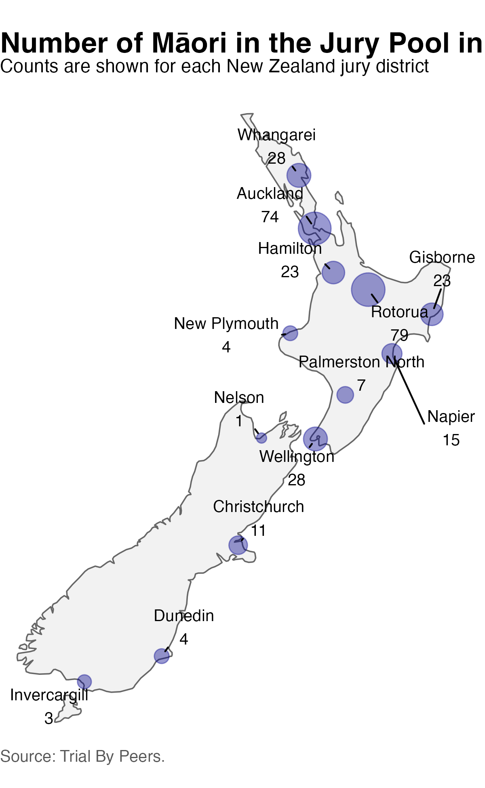



## Activity Introduction

In 1993, the New Zealand Department of Justice surveyed jury pools across the country to examine the representation of Māori, the Indigenous people of New Zealand. The survey covered all potential jurors who arrived at court during a period in September and October 1993. Nationally, Māori made up 9.5% of the eligible population and 10.1% of the jury pool, suggesting that Māori were adequately represented (Dunstan, Paulin, and Atkinson 1995). In this activity, we'll investigate whether this overall conclusion changes when we examine the data by region.

{fig-alt="Number of Māori in regional jury district pools surveyed in 1993. Major urban areas like Auckland and Rotorua have the highest number of Māori in the jury pool with 74 and 79 Māori respectively." fig-align="center"}

## Learning Objectives

In this lab, you will investigate Māori representation on New Zealand juries using summary tables, percentages, and data visualizations. Along the way, you will explore how an abstract concept like **representation** can be translated into statistical measures and how different ways of summarizing data can lead to different conclusions.

You will practice:

-   constructing and interpreting summary tables,
-   calculating percentages and expected counts,
-   joining datasets to compare jury pools with census data,
-   visualizing patterns using `ggplot2`, and
-   interpreting results at both the district and national levels.

This activity also introduces **Simpson's paradox**, a phenomenon in which an overall pattern changes or reverses after accounting for an important grouping variable.

::: callout-tip
## By the end of this activity, you will be able to:

-   Calculate and interpret percentages of Māori representation within jury districts.
-   Join multiple datasets using a common key.
-   Compare observed jury representation with expected representation based on census data.
-   Explain how district size influences national summary statistics.
-   Create and interpret visualizations of representation using `ggplot2`.
-   Explain Simpson's paradox and describe why conclusions based on aggregated data can differ from those based on subgroup analyses.
-   Reflect on how statistical measures shape our understanding of concepts such as equality, representation, and fairness.
:::

## Simpson's Paradox

Simpson's paradox can occur when we study the relationship between two variables but ignore an important third variable.

Simpson's paradox reminds us that:

-   Not considering an important variable can distort the relationship we see.
-   Omitting an explanatory variable can change the measure of association between another explanatory variable and a response variable.
-   Adding a third variable can change the apparent relationship between the first two variables.

## Part 1: Getting to know the data

The table below contains the number of Māori in the jury pool and the total number of people in the jury pool for each New Zealand jury district. These data come from *Trial By Peers* (Dunstan, Paulin, and Atkinson 1995), a nationwide survey of jury pools conducted from September to October in 1993.

```{r load_packages}
library(tidyverse)
```

```{webr load_data}

district_jury <- tribble(
  ~district,         ~n_maori, ~n_jury_pool,
  "Whangarei",       28,       167,
  "Auckland",        74,       822,
  "Hamilton",        23,       200,
  "Rotorua",         79,       338,
  "Gisborne",        23,        78,
  "Napier",          15,       121,
  "New Plymouth",    4,        98,
  "Palmerston N",    7,       163,
  "Wellington",      28,       373,
  "Nelson",          1,        59,
  "Christchurch",    11,       333,
  "Dunedin",         4,       167,
  "Invercargill",    3,        62
)

head(district_jury)
```

Notice that the table gives the number of Māori in each jury pool, but it does not report the number of non-Māori.

### Exercise 1

Using the information provided, calculate the number of non-Māori in each jury pool.

```{webr non_maori}
#| exercise.setup: load_data

district_jury <- district_jury |>
  mutate(
    n_non_maori = ________
  )

head(district_jury)
```

### Exercise 2

How many people were surveyed altogether? Complete the code below.

```{webr jury_totals}
#| exercise.setup: 
#|   - load_data
#|   - non_maori

district_jury |>
  summarize(
    total_people = sum(_______),
    total_maori = sum(_______),
    total_non_maori = sum(_______)
  )

```

### Exercise 3

What proportion of the entire jury pool identified as Māori?

Looking at the results nationally, *Trial By Peers* notes that

> "9.5 percent of people living within the jury districts were Māori. This compares with 10.1 percent of Māori in the pool of potential jurors."

Let's verify the second statistic ourselves.

```{webr}
#| label: jury_summary
#| exercise.setup: 
#|   - load_data
#|   - non_maori

district_jury_summary <- district_jury |>
  summarize(
    total_jury = sum(n_jury_pool),
    total_jury_maori = sum(_____),
    maori_pct = total_jury_maori / _____ * 100
  ) |>
  mutate(
    maori_pct = round(maori_pct, 1)
  )

district_jury_summary
```

::: callout-tip
### Question

At the national level, does Māori representation in the jury pool appear to be higher, lower, or the same as their percentage of the eligible popluation?
:::


## Part 2 Exploring each district

The national percentage summarizes all districts together. However, jury pools are selected locally, so it is also useful to examine each district individually.

::: callout-tip
### Reflection

From the chapter introduction, can you think of a few reasons why there could be regional variation in district jury selection?
:::

Calculate the percentage of each district jury pool that identified as Māori by filling in the blank

```{webr calculate_pct_maori}
#| exercise.setup: 
#|   - load_data
#|   - non_maori
district_summary <- district_jury |>
  mutate(
    jury_maori_pct = (_____ / n_jury_pool) * 100
  )

district_summary
```


### Exercise 4

Arrange the districts from the highest to the lowest percentage of Māori in the jury pool.

```{webr mean percentage Maori}
#| exercise.setup: 
#|   - load_data
#|   - non_maori
#|   - calculate_pct_maori

district_summary |>
  arrange(desc(________))
```

-   Which district has the highest percentage?
-   Which district has the lowest percentage?

### Exercise 5

Let's create a bar chart showing the percentage of Māori in the jury pool for each district. Try commenting and uncommenting (adding or removing a `#`) the two options for the x axis below. Which one helps us see the districts with the highest māori jury percentage?

```{webr pct maori bar chart}
#| exercise.setup: 
#|   - load_packages
#|   - load_data
#|   - non_maori
#|   - calculate_pct_maori
district_summary |>
  ggplot(aes(
    # x = fct_reorder(district, jury_maori_pct),
    x = district,
    y = jury_maori_pct
  )) +
  geom_col() +
  coord_flip() +
  labs(y = "Jury District")
```

## Part 3: Comparing the percentages to the eligible population

Westbrooke (1998) compared these jury pool percentages to the percentage of Māori in the eligible population (ages 20–64) from the 1991 New Zealand Census. The eligible population Westbrooke calculated in each district is given below. 

```{webr load_district_census}

district_census <- tribble(
  ~district,         ~eligible_maori_pct,
  "Whangarei",       17.0,               
  "Auckland",         9.2,
  "Hamilton",        13.5,
  "Rotorua",         27.0,
  "Gisborne",        32.2,
  "Napier",          15.5,
  "New Plymouth",     8.9,
  "Palmerston N",     8.9,
  "Wellington",       8.7,
  "Nelson",           3.9,
  "Christchurch",     4.5,
  "Dunedin",          3.3,
  "Invercargill",     8.4,
)
```

We can use these data to calculate the expected number of individuals and compare this to the numebr of observed by joining our two datasets together.

::: callout-note
### Joining datasets

A join combines information from two datasets using one or more variables that uniquely identify matching observations. These variables are called keys.

In this example, each row represents a jury district, so the district name serves as the key.
:::

### Exercise 6

Can you identify the key variable that will link our datasets?

```{webr join_summary_census}
#| exercise.setup: 
#|   - load_packages
#|   - load_data
#|   - non_maori
#|   - calculate_pct_maori
#|   - load_district_census
district_summary <- district_summary |>
  left_join(district_census, by = ______)
```

Let's take a look at the combined data. Note that there are now two percentages for every district:

-   `jury_maori_pct` — the percentage of Māori in the jury pool.
-   `eligible_maori_pct` — the percentage of Māori in the eligible population.

### Exercise 7

Add a new variable called `difference` that measures the difference between these two percentages.

```{webr difference_observed_expected}
#|   - load_packages
#|   - load_data
#|   - non_maori
#|   - calculate_pct_maori
#|   - load_district_census
#|   - join_summary_census
district_summary <- district_summary |>
  mutate(
    difference = ________ - ________
  )
```

**Questions** 
- What does a positive value of difference mean? 
- What does a negative value mean? 
- Which district has the largest difference?

## Visualizing the differences

```{webr eligible vs actual}
#|   - load_packages
#|   - load_data
#|   - non_maori
#|   - calculate_pct_maori
#|   - load_district_census
#|   - join_summary_census
#|   - difference_observed_expected
ggplot(
  district_summary,
  aes(
    x = eligible_maori_pct,
    y = jury_maori_pct
  )
) +
  geom_point(size = 3) +
  geom_abline(
    slope = 1,
    intercept = 0,
    linetype = "dashed",
    color = "red"
  ) +
  geom_text(
    aes(label = district),
    hjust = -0.1,
    size = 3
  ) +
  labs(
    x = "Eligible Māori (%)",
    y = "Jury Pool Māori (%)"
  )
```

The dashed line represents perfect representation.

**Questions** 
- What does it mean for a point to lie on the dashed line? 
- What does it mean for a point to lie below the dashed line? 
- Do you notice an overall pattern?

```{webr view the district summary}
#|   - load_packages
#|   - load_data
#|   - non_maori
#|   - calculate_pct_maori
#|   - load_district_census
#|   - join_summary_census
#|   - difference_observed_expected
district_summary
```

## Part 4: Defining "equal representation"

So far, we have compared percentages. Another way to think about equality is to ask:

> If every district's jury pool perfectly reflected its eligible population, how many Māori would we expect to see?

This requires translating a percentage into an expected count.

### Exercise 8

Calculate the expected number of Māori in each district.

```{webr calculate expected numbers}
#|   - load_packages
#|   - load_data
#|   - non_maori
#|   - calculate_pct_maori
#|   - load_district_census
#|   - join_summary_census
#|   - difference_observed_expected
district_summary <- district_summary |>
  mutate(
    expected_maori =
      ________ / 100 *
      ________
  )
```

### Comparing observed and expected counts

Now compare the number of Māori observed in the jury pool with the expected number.

```{webr calculate_shortfall}
#|   - load_packages
#|   - load_data
#|   - non_maori
#|   - calculate_pct_maori
#|   - load_district_census
#|   - join_summary_census
#|   - difference_observed_expected
district_summary <- district_summary |>
  mutate(
    shortfall = ________ - ________
  )
```

Which district has the largest shortfall in terms of number of individuals?

### Visualization

```{webr visualize the expected}
#|   - load_packages
#|   - load_data
#|   - non_maori
#|   - calculate_pct_maori
#|   - load_district_census
#|   - join_summary_census
#|   - difference_observed_expected
#|   - calculate_shortfall
district_summary |>
  select(
    district,
    n_maori,
    expected_maori
  ) |>
  pivot_longer(
    cols = c(n_maori, expected_maori),
    names_to = "type",
    values_to = "count"
  ) |>
  ggplot(
    aes(
      district,
      count,
      fill = type
    )
  ) +
  geom_col(position = "dodge") +
  coord_flip()
```

### Reflection

Looking district by district, how would you describe Māori representation?

How does this compare with the national percentage you calculated at the beginning of the lab?

In the next section, you'll discover why these two perspectives appear to tell different stories—and how this apparent contradiction is an example of Simpson's paradox.

## Part 5. Why do the national and district-level results differ?

The national result appears to suggest that Māori were adequately represented in the jury pool. However, the district-level comparisons tell a different story. Māori were underrepresented in most individual districts.

This difference arises because the national percentage is not a simple average of the district percentages. Instead, it is a weighted average, where districts with larger jury pools contribute more heavily to the overall result.

Several of the larger jury pools were located in districts with relatively high eligible Māori populations. These districts therefore contributed a large number of Māori jurors to the national total. Their influence was strong enough to make Māori representation appear adequate when all districts were combined, even though the Māori percentage within many districts remained below the corresponding eligible percentage.

### A question of influence

How much influence does each district have?

So far, we have compared each district individually. However, when we calculated the national percentage, we combined all of the districts together.

Does every district contribute equally to the national result?

The answer is no.

Districts with larger jury pools contribute more people to the national calculation than districts with smaller jury pools. As a result, larger districts have more influence on the overall percentage.

One way to measure this influence is to calculate the proportion of the national jury pool that comes from each district.

For example, if a district contains 100 people out of a national jury pool of 2,500 people, then that district contributes

$$
\frac{100}{2500} =  0.04
$$

or 4% of the national calculation.

### Exercise 9

Calculate the influence of each district.

```{webr calculate_influence}
#|   - load_packages
#|   - load_data
#|   - non_maori
#|   - calculate_pct_maori
#|   - load_district_census
#|   - join_summary_census
#|   - difference_observed_expected
#|   - calculate_shortfall

district_summary <- district_summary |>
  mutate(
    influence =
      n_jury_pool /
      sum(n_jury_pool)
  )

```

Multiply by 100 to express the influence as a percentage.

```{webr convert_percentage}
#|   - load_packages
#|   - load_data
#|   - non_maori
#|   - calculate_pct_maori
#|   - load_district_census
#|   - join_summary_census
#|   - difference_observed_expected
#|   - calculate_shortfall
#|   - calculate_influence
district_summary <- district_summary |>
  mutate(
    influence_pct =
      round(influence * 100, 1)
  )

```

Take a look at the results.

```{webr view results}
#|   - load_packages
#|   - load_data
#|   - non_maori
#|   - calculate_pct_maori
#|   - load_district_census
#|   - join_summary_census
#|   - difference_observed_expected
#|   - calculate_shortfall
#|   - calculate_influence
#|   - convert_percentage
district_summary |>
  select(
    district,
    n_jury_pool,
    influence_pct
  ) |>
  arrange(desc(influence_pct))

```

**Questions** 
- Which district contributes the largest share of the national jury pool? 
- Which district contributes the smallest share? 
- Are all districts equally influential?

## Visualizing district influence

Let's visualize how much each district contributes to the national statistic.

```{webr visualize influence}
# install.packages("waffle")
#|   - load_packages
#|   - load_data
#|   - non_maori
#|   - calculate_pct_maori
#|   - load_district_census
#|   - join_summary_census
#|   - difference_observed_expected
#|   - calculate_shortfall
#|   - calculate_influence
#|   - convert_percentage
library(waffle)

district_summary |>
  mutate(
    influence_pct = round(influence_pct)
  ) |>
  arrange(desc(influence_pct)) |>
  with(
    waffle(
      parts = setNames(influence_pct, district),
      rows = 10,
      size = 0.8,
      colors = scales::viridis_pal(option = "D")(13),
      title = "Each District's Contribution to the National Jury Pool"
    )
  ) +
  labs(
    subtitle = "Each square represents approximately 1% of the national jury pool.",
    caption = "Larger jury pools contribute more heavily to the national statistic."
  ) +
  theme(
    legend.position = "right",
    plot.title = element_text(face = "bold")
  )
```

## Reflection

Notice that Auckland contributes a much larger share of the national jury pool than Gisborne or Nelson. This means that Auckland's jury pool has much more influence on the national percentage than those smaller districts.

The national percentage is therefore not the average of the district percentages. Instead, it is a weighted average, where districts with larger jury pools contribute more heavily to the overall result.

This observation provides an important clue for understanding Simpson's paradox. If districts with the greatest influence also have different demographic compositions than smaller districts, then the national percentage may tell a different story than the district-level percentages.

### Exercise 10

Compare the simple average of the district percentages with the national percentage.

```{webr calculate simple average}
#|   - load_packages
#|   - load_data
#|   - non_maori
#|   - calculate_pct_maori
#|   - load_district_census
#|   - join_summary_census
#|   - difference_observed_expected
#|   - calculate_shortfall
#|   - calculate_influence
#|   - convert_percentage
district_summary |>
  summarize(
    average_district_pct = mean(jury_maori_pct),
    national_pct = sum(n_maori) / sum(n_jury_pool) * 100
  )
```

**Questions**

-   Why are these two percentages different?
-   Which calculation gives every district equal influence?
-   Which calculation gives larger districts more influence?
-   Which calculation would you use if your goal were to understand representation within districts? Which would you use if your goal were to understand representation across all potential jurors?

## Part 7. Final Conclusions

Westbrooke (1998) emphasizes two broader lessons from this result:

1.  Consider the level of analysis

Aggregating data can hide important patterns. Results that appear equitable at the national level may look very different when examined within districts or other meaningful groups.

2.  Investigate unexpected findings.

When an analysis produces a surprising result, it is important to examine how the data were collected, grouped, and weighted. An unexpected result may reflect an error, but it may also reveal an important feature of the data-generating process.

In this case, examining the data at a lower level of aggregation reveals that the national statistic does not fully describe Māori representation across jury districts.

**Reflection questions**

-   Why do districts with larger jury pools have more influence on the national percentage?
-   Would the national result be the same if every district were given equal weight?
-   Which conclusion is more useful for evaluating representation: the national percentage, the district-level percentages, or both?
-   What information is lost when all districts are combined into a single national statistic?

### References

Dunstan, S., Paulin, J., and Atkinson, K. (1995), Trial By Peers? The Composition of New Zealand Juries, *Wellington: Department of Justice.*

Westbrooke, I. (1998) Simpson’s Paradox: An Example in a New Zealand Survey of Jury Composition, *CHANCE*, 11:2, 40-42, DOI: 10.1080/09332480.1998.10542093

